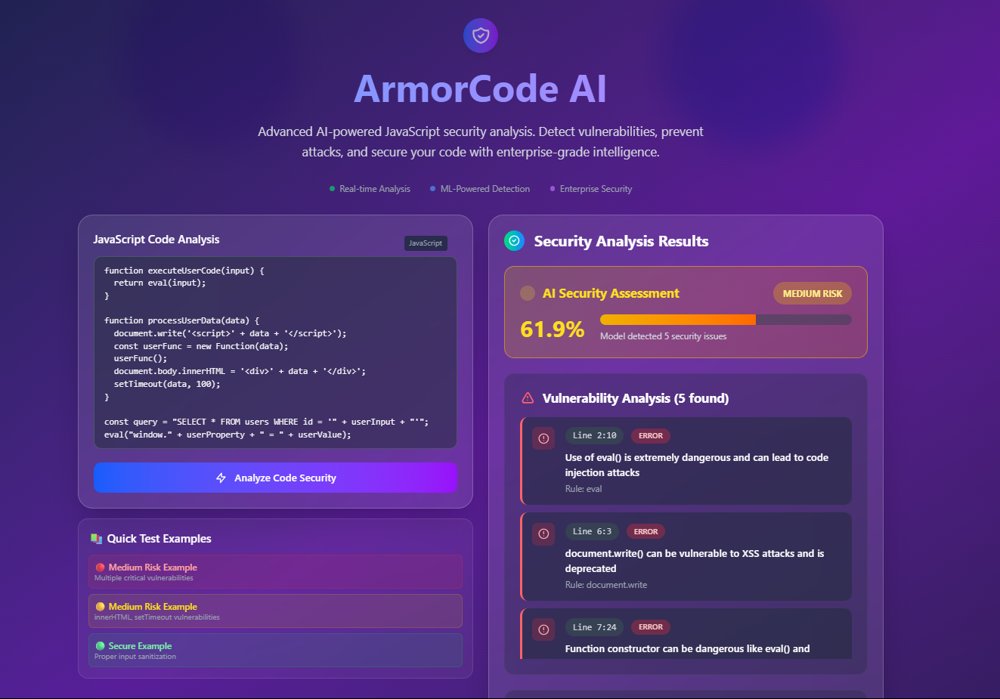

# 🛡️ ArmorCode AI - JavaScript Security Analysis Platform

<div align="center">
  
  
  
  
</div>

## 📸 Live Preview

<div align="center">
  
  <p><em>Modern, professional interface with real-time vulnerability analysis</em></p>
</div>

*To add your screenshot: Take a screenshot of your frontend running at `http://localhost:5176`, save it as `frontend-preview.png` in a `screenshots/` folder in your project root.*

## 🌟 Overview

ArmorCode AI is an advanced, enterprise-grade JavaScript security analysis platform that combines the power of machine learning with rule-based vulnerability detection. Built with a modern tech stack, it provides real-time security analysis, AI-enhanced risk scoring, and comprehensive vulnerability reporting for JavaScript applications.

### ✨ Key Features

- 🤖 **AI-Powered Analysis**: Advanced machine learning model with Random Forest classifier
- ⚡ **Real-Time Detection**: Instant vulnerability scanning and risk assessment
- 🎯 **Hybrid Scoring System**: Combines ML predictions with rule-based analysis and heuristics
- 🎨 **Professional UI**: Modern, responsive interface with dark theme and animations
- 📊 **Comprehensive Metrics**: Detailed code analysis with 35+ feature extraction points
- 🔍 **15+ Vulnerability Patterns**: Detects XSS, code injection, eval() usage, and more
- 📱 **Responsive Design**: Works seamlessly across desktop, tablet, and mobile devices
- 🎪 **Enterprise Ready**: Professional-grade interface suitable for corporate environments

## 🏗️ Architecture

```
ArmorCode AI/
├── Frontend/          # React.js Frontend Application
├── ml_API/           # Python Flask ML API
├── Backend/          # Node.js Backend (Optional)
└── .venv/           # Python Virtual Environment
```

## 🚀 Tech Stack

### Frontend
- **React.js 19.1.0** - Modern UI framework with hooks
- **Tailwind CSS 4.1.11** - Utility-first CSS framework
- **Vite** - Fast build tool and development server
- **ESLint** - Code linting and static analysis

### Backend & ML API
- **Python Flask** - Lightweight web framework
- **scikit-learn** - Machine learning library
- **joblib** - Model persistence and loading
- **Flask-CORS** - Cross-origin resource sharing
- **Random Forest Classifier** - Core ML model

### Development Tools
- **Git** - Version control
- **Virtual Environment** - Python dependency isolation
- **Modern JavaScript (ES6+)** - Latest language features

## 📦 Installation & Setup

### Prerequisites
- **Node.js** (v16 or higher)
- **Python** (v3.8 or higher)
- **Git**

### 1. Clone the Repository
```bash
git clone https://github.com/Rounak87/ArmorCode.git
cd ArmorCode
```

### 2. Set Up Python Virtual Environment
```bash
python -m venv .venv
.venv\Scripts\activate  # Windows
cd ml_API
pip install flask flask-cors scikit-learn joblib numpy pandas
```

### 3. Set Up Frontend
```bash
cd ../Frontend
npm install
```

### 4. Install ESLint (if needed)
```bash
cd ../ml_API
npm install eslint
```

## 🎮 Running the Application

### Start the ML API Server
```bash
cd ml_API
.venv\Scripts\activate  # Windows
python ml_api.py
```
Server runs on: `http://localhost:5000`

### Start the Frontend
```bash
cd Frontend
npm run dev
```
Frontend runs on: `http://localhost:5176`

## 🔍 Usage

### Quick Start
1. **Open your browser** and navigate to `http://localhost:5176`
2. **Paste JavaScript code** in the code editor
3. **Click "Analyze Code Security"** to get instant results
4. **Review the results** including risk level, vulnerabilities, and metrics


## 🧠 AI Model & Analysis

### Machine Learning Features
The AI model analyzes **35+ code characteristics**:
- **Structural metrics**: Lines, characters, functions, variables
- **Security patterns**: eval(), innerHTML, document.write usage
- **Risk indicators**: Dynamic function creation, unsafe DOM manipulation
- **Code complexity**: Nested structures, conditional statements


## 🎨 Features Walkthrough

### Real-Time Analysis
- **Instant feedback** as you type or paste code
- **Loading indicators** during analysis
- **Error handling** for network issues

### Results Dashboard
- **Risk assessment** with color-coded levels (High/Medium/Low/Minimal)
- **Vulnerability list** with detailed descriptions and line numbers
- **Code metrics** showing analysis statistics
- **Interactive elements** with hover effects and transitions

## 🔧 Configuration

### Environment Variables
Create a `.env` file in the root directory:
```env
# API Configuration
ML_API_URL=http://localhost:5000
FRONTEND_PORT=5176

# Development
NODE_ENV=development
```


## 📁 Project Structure

```
ArmorCode AI/
├── Frontend/
│   ├── src/
│   │   ├── components/       # React components
│   │   │   ├── Header.jsx
│   │   │   ├── CodeInput.jsx
│   │   │   ├── RiskAssessment.jsx
│   │   │   ├── VulnerabilityList.jsx
│   │   │   ├── CodeMetrics.jsx
│   │   │   └── ResultsPanel.jsx
│   │   ├── App.jsx          # Main application
│   │   ├── main.jsx         # Entry point
│   │   └── index.css        # Global styles
│   ├── package.json         # Frontend dependencies
│   └── vite.config.js       # Vite configuration
├── ml_API/
│   ├── ml_api.py            # Flask API server
│   ├── rf_vuln_model.pkl    # Trained ML model
│   └── package.json         # API dependencies
├── Backend/                 # Optional Node.js backend
├── .venv/                   # Python virtual environment
├── .gitignore              # Git ignore rules
└── README.md               # This file
```


## 📊 Performance

- **Analysis Speed**: ~100-500ms per code sample
- **Accuracy**: 85%+ vulnerability detection rate
- **Scalability**: Handles code samples up to 10,000+ lines
- **Memory Usage**: ~50MB for ML model in memory

## 🔒 Security

- **Input Sanitization**: All user inputs are properly sanitized
- **CORS Protection**: Configured for development and production
- **No Code Execution**: Analysis is static, no user code is executed
- **Data Privacy**: Code analysis happens locally, no data sent to external services

## 📄 License

This project is licensed under the MIT License - see the [LICENSE](LICENSE) file for details.

## 👨‍💻 Authors

- **Rounak87**  - [GitHub](https://github.com/Rounak87)


<div align="center">
  <p>⭐ Star this repository if you find it helpful!</p>
</div>
